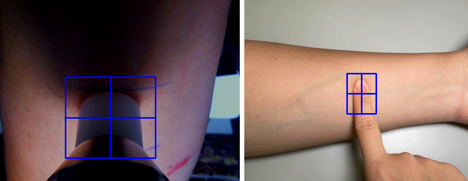

# pyCRTScripts

User-friendly scripts designed to make pyCRT accessible to non-programmers.

Calculates pCRT and CRT 90-10% on the BGR G and LAB A channels of videos
supplied by the user.

# Table of contents

- [Usage](#usage)
  - [Through the EXE file (Windows only)](#through-the-exe-file-windows-only)
  - [Through the command line](#through-the-command-line)
- [Configuration file](#configuration-file)
  - [Files](#files)
  - [Video](#video)
  - [Measurement](#measurement)
  - [General](#general)
- [To-do](#to-do)

# Installation

[Download the latest version](https://github.com/Photobiomedical-Instrumentation-Group/pyCRTScripts/releases/latest) and extract the zip file into a new directory.

# Usage

## Through the EXE file (Windows only)

Assuming the settings in the configuration file haven't been altered, the
following steps describe the usage of the program:

1. Run `measure_crt.exe`.

Windows may block the execution of the program due to "unknown source". This
is expected. Simply click "More info" -> "Run anyway".

2. Select whether you would like to measure CRT in a single video or in all
   the videos inside a directory.
3. A window should appear showing the video you selected, or the first video
   in the directory. *If you do not see the window, it might have appeared
   under another window, such as the terminal.*
4. If a Region of Interest (ROI) was not specified in the configuration file
   (see below), press the spacebar key **once** when pressure is being applied
   (i.e. when a finger, rod, or other instrument is touching the skin and
   applying pressure). The video will be paused and you can click and drag the
   mouse to draw a square around the desired ROI. It is highly recommended
   that the ROI encompass the **entire area of the pressure application
   instrument** with a small margin, as in the pictures below:

   

   Once the ROI has been drawn, **press the spacebar again** to confirm the
   selection. Video playback should start from the beginning.

5. Check the terminal. If a ROI was selected manually, it should appear there
   as a list of 4 numbers.
6. Wait for video playback to finish.
7. If any CRT measurement were successful, you should see plots of the average
   intensities and the CRT calculation result.
8. The aforementioned graphs are saved in the `dists/measure_crt/Plots`
   directory.
9. The file `results_sheet.csv` is created automatically. It contains a
   spreadsheet of the parameters and results of every CRT measurement
   performed using the program. The file `results_sheet.xlsx` is the same
   spreadsheet, but in a format more suitable for spreadsheet software such as
   MS Excel.
10. A log of all the messages printed on the terminal is kept in the file
    log.txt, organized by the date and time of execution of this program.

## Through the command line

The scripts can also be executed in your Python environment. For that, you
must download/clone the repository. Simply run either `measure_crt.py` in the
command line:

```
python measure_crt.py
```

Upon running the script, you may proceed according to the instructions for the
EXE file.

In case you specifically want to measure CRT from a single video file or from
an entire directory of videos, you may run the scripts `measure_crt_video.py`
and `measure_crt_dir.py` respectively.

# Configuration file

The CRT measurement parameters and the program's settings can be configured
with the `configuration.toml`, which is read at the start of each execution.

Below is an application-oriented explanation of each section of the config
file and their parameters:

## Files

* **plotPath**: string, default = "Plots"

    Path of the directory in which the plots will be saved. If the directory
    does not exist, an Exception will be raised.

* **csvPath**: string, default = `"results_sheet.csv"`
    
    Path of the CSV file where the results of all the successful executions of
    the script will be summarized. If the file does not exist, the script will
    create it on this path.

* **npzPath**: string, default = `"Npz"`

    Path of the directory in which the NPZ files containing the array of
    average intensities and detailed CRT measurement results will be saved. If
    the directory does not exist, an Exception will be raised.
    
* **provideXLSX**: boolean, default = `true`

    Determines whether or not the XLSX will be generated. It has the same
    contents as the CSV file, but should have better compatibility with
    Excel/Calc/Sheets, etc.

* **overwrite**: boolean, default = `false`

    If set to `false`, pyCRTScripts will not overwrite the results of previous
    executions in the same video file, but instead it will add numbered
    suffixes (as in "(1)", "(2)", etc) to the files it generates and the
    entries in the summary spreadsheet.

## Video

* **showVideoFrames**: boolean, default = `true`
    
    If `false`, the video will not be displayed, which speeds up processing
    but makes it impossible to select the ROI manually. If
    [Measurement](#measurement)/roi is not specified (i.e. set to `-1`), the
    video frames will be displayed until the user selects the ROI.

* **playbackSpeed**: string, default = `"normal"`

    What is the maximum speed at which the video should be played. This
    parameter accepts 3 possible values:

    `"fast"`: the playback speed will be limited only by the frame processing
    power of your computer.

    `"normal"`: the video will be played at, at most, its original framerate.

    `"slow"`: the video will be played under 10 FPS.

* **showEdgeDetection**: boolean, default = `false`

    If `true`, displays the edge-detection-processed frames. Useful for
    debugging.


## Measurement

* **roi**: array of 4 integers, default = `-1`

    The Region Of Interest, that is, the area in which the Capillary Refill
    Time phenomenon occurs. The first 2 numbers represent the X and Y
    coordinates of the upper-left corner of the square, and the last 2 numbers
    are the width and height, respectively. If set to `-1`, no ROI pre-defined
    ROI will be set, and the user must specify one manually during video
    playback.

* **rescaleFactor**: float, default = `0.5`

    Factor by which the video will be rescaled during playback and CRT
    calculation. The rescaling will preserve the original aspect ratio, and
    should not affect the measurement results. **This parameter can be very
    useful if the video's dimensions are very large, which impedes display on
    smaller screens and significantly slows down processing time.**

* **fromTime**: float, default = `-1`

    Time (in seconds) after which the Capillary Refill phenomenon starts. It
    does not represent the exact time where CR starts, but rather, a lower
    bound for the start time. If set to `-1`, then automatic CRT interval
    detection will be performed on the video. It is recommended that you fix
    this value in your measurement protocol instead of relying on automatic
    CRT interval detection.

* **toTime**: float, default = `-1`

    Time (in seconds) before which the Capillary Refill phenomenon ends. It
    does not represent the exact time where CR ends, but rather, a higher
    bound for the end time. If set to `-1`, then automatic CRT interval
    detection will be performed on the video. Again, we recommend setting this
    parameter as constant in your measurement protocol.

* **pCRTAlgorithm**: string, default = `"first positive peak"`

    Determines which algorithm is used for Critical Time (CT) selection, which
    marks the end of the CR phenomenon. This determines the success rate of
    measurements and how repeatable they are. Possible values are:

    `"first positive peak"`: has a high success rate, is one of the most
    repeatable, and results usually have a low uncertainty.

    `"first that works"`: has the highest success rate but low repeatability,
    and results have low uncertainty.

    `"best fit"`: has the same success rate as `"first that works"` and the
    lowest uncertainty, but is the least repeatable.

    `"strict"`: has the lowest success rate and may have high uncertainty, but
    is the most repeatable.

    Note that each method can result in different values for the CRT in the
    same video, so it is important to select a single method to use throughout
    your study.

* **maxUncertaintyRatio**: float, default = `1.0`

    The maximum relative uncertainty. If `(CRT / std(CRT)) >
    exclusionCriteria`, pyCRTScripts will report that the measurement has
    failed. You may use this parameter to automatically reject noisy
    measurements and outliers. The exclusionMethods `best fit` and `first that
    works` take this parameter into account when calculating the CRT.

* **initialGuesses**: array of 3 floats, default = `[1.0, -0.5, 0.0]`

    The initial `a`, `b` and `c` parameters estimates for the exponential
    fit. The exponential function is: `I(t) = a*exp(b*t) + c`, and it is used
    to calculate the pCRT.

## General

* **enabledPlots**: array of strings, default = `["bgr_g", "lab_a", "edges"]`

    Which plots will created, shown and saved in the plots directory. Accepts
    the following strings:

    `"bgr_g"`: Enables the pCRT and CRT 90-10% plots on the BGR G channel.

    `"lab_a"`: Enables the pCRT and CRT 90-10% plots on the LAB A channel.

    `"edges"`: Enables the edge detection plot.

* **showPlots**: boolean, default = `true`

    Whether or not to show the Average Intensities and CRT plots after CRT
    calculation. Only the plots listed on `enabledPlots` will be created. In
    either case, the plots will still be saved to the plots directory
    specified in plotPath.

* **simplerPlots**: boolean, default = `true`

    Includes less information in the plots enabled on `enabledPlots`, intended
    to reduce clutter from data that is only relevant for debugging.

* **askConfirmation**: boolean, default = `true`

    If you choose to measure all videos in a directory upon startup of
    `measure_crt`, this parameter will determine whether or not to show a
    confirmation pop-up after each video, asking if it should continue to the
    next video in the list or manually select another video.

* **logLevel**: string, default = `"INFO"`

    How detailed the log should be. The options are, in decreasing level of
    detail: `"DEBUG"`, `"INFO"`, `"WARNING"` and `"ERROR"`.

* **writeLogFile**: boolean, default = `true`

    Determines whether or not to write the `log.txt` file, which logs each
    step of execution of pyCRTScripts across multiple executions, depending on
    the `logLevel` parameter.

# To-do

This is a list of features I would like to implement (I don't promise I will
actually implement them all):

* Try to implement interactive fromTime, toTime and algorithm selection;
* Add tests for pyCRTScripts;
* Create specific exception types for not selecting the ROI and for failed CRT
  fit;
* Add option to ignore duplicates in multiVideoPipeline;
